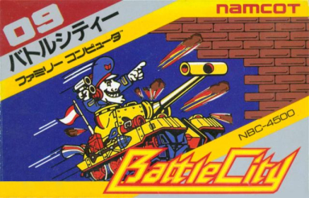

# **Battle City Remake**

## Controls
- **W** - move forward
- **A** - move left
- **S** - move backward
- **D** - move right

- **Spacebar** - shoot
## Phase 3:

:white_check_mark: **Cell types** - Empty, Brick, Stone, Mirror, Water, Cracked Brick, Forest, Home

:white_check_mark: **Stage Layout** - From stage file

:white_check_mark: **Player and Enemy Spawn Location** - specified in stage file

:white_check_mark: **Enemy Spawn Frequency** - spawns periodically

:white_check_mark: **Bullet Collision** - collides with each other

:white_check_mark: **Active bullets for Player** - 1

:white_check_mark: **Enemy Tank Types** - 2

:white_check_mark: **Stages** - 2

:white_check_mark: **Player Lives** - 3

:white_check_mark: **Restart Game**

:white_check_mark: **Cheat Code**

:white_check_mark: **Sounds**

:white_check_mark: **Powerups**

## Contributions
The creators of the remake are Dale Sealtiel Flores and Gabriel Ian Carl Matias. Both of us have contributed to the project equally. We decided to utilize collaborative coding sessions and help each other if one is having difficulties with a feature.  That being said, here are the features that each member mainly developed:

Dale:
- Block and UI Sprites
- Foundational Gameplay logic
- Water, Forest, and Mirror Block logic
- Collision and Bounding Box Collision functions
- Powerups
- Cheat Codes
- Video Editing

Gabe:
- Tank Sprites
- Sound effects and music
- Tilemap design and parsing
- Brick and Cracked Brick logic
- Randomized Enemy Movement
- Spawnpoint logic
- Video Voice-Over and Game Demonstration

Note that features not mentioned here have been contributed by both members of the party equally.

## How to edit
The map is made up of a 17x17 grid that is based on the grid inside `level_1` and `level_2` in `tilemap.py`

To edit/create the map, you must replace a tile inside the grid. An `'empty'` tile in the grid means that it has no block.

The names for each block to put in a tile are as follows:

- Brick - `'brick'`
- Stone - `'stone'`
- Water - `'water'`
- Forest - `'forest'`
- Mirror that has a positive slope - `'mirrorPos'`
- Mirror that has a negative slope - `'mirrorNeg'`
- Home - `'home'`
- Enemy Spawnpoint - `'enemySpawn'`
- Player Spawnpoint - `'playerSpawn'`

### Cheats
To access cheats, you must click buttons at the same time.

The cheats are as follows:
- `F` + `U` + `N` - adds lives to the player
- `C` + `S` - adds a shield to the player
- `G` + `A` + `B` + `E` - max shooting interval
- `Backspace` - pass through walls

Debugging Tools:
- `1` - restarts game at level 1
- `2` - skips to level 2
  
## Link to the Demo Video
[Demonstration Video](https://drive.google.com/file/d/1D38G2vFyJugXZL_U3p929yaq7bCZclMf/view?usp=sharing)
